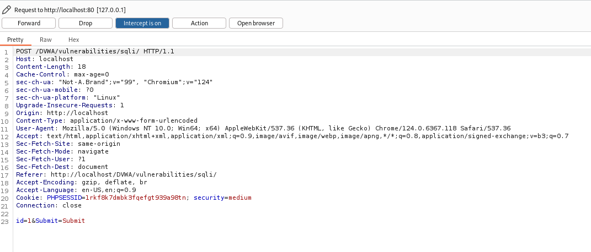
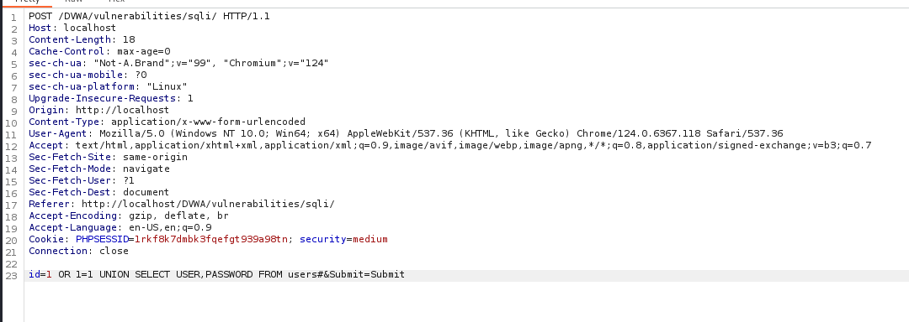

---
# Front matter
lang: ru-RU
title: "Индивидуальный проект - этап 5"
subtitle: "Использование BurpSuite"
author: "Алькамаль Ибрахим Мохсейн Мохаммед Али"

# Formatting
toc-title: "Содержание"
toc: true # Table of contents
toc_depth: 2
lof: true # List of figures
fontsize: 12pt
linestretch: 1.5
papersize: a4paper
documentclass: scrreprt
polyglossia-lang: russian
polyglossia-otherlangs: english
mainfont: PT Serif
romanfont: PT Serif
sansfont: PT Sans
monofont: PT Mono
mainfontoptions: Ligatures=TeX
romanfontoptions: Ligatures=TeX
sansfontoptions: Ligatures=TeX,Scale=MatchLowercase
monofontoptions: Scale=MatchLowercase
indent: true
pdf-engine: lualatex
header-includes:
  - \linepenalty=10 # the penalty added to the badness of each line within a paragraph (no associated penalty node) Increasing the value makes tex try to have fewer lines in the paragraph.
  - \interlinepenalty=0 # value of the penalty (node) added after each line of a paragraph.
  - \hyphenpenalty=50 # the penalty for line breaking at an automatically inserted hyphen
  - \exhyphenpenalty=50 # the penalty for line breaking at an explicit hyphen
  - \binoppenalty=700 # the penalty for breaking a line at a binary operator
  - \relpenalty=500 # the penalty for breaking a line at a relation
  - \clubpenalty=150 # extra penalty for breaking after first line of a paragraph
  - \widowpenalty=150 # extra penalty for breaking before last line of a paragraph
  - \displaywidowpenalty=50 # extra penalty for breaking before last line before a display math
  - \brokenpenalty=100 # extra penalty for page breaking after a hyphenated line
  - \predisplaypenalty=10000 # penalty for breaking before a display
  - \postdisplaypenalty=0 # penalty for breaking after a display
  - \floatingpenalty = 20000 # penalty for splitting an insertion (can only be split footnote in standard LaTeX)
  - \raggedbottom # or \flushbottom
  - \usepackage{float} # keep figures where there are in the text
  - \floatplacement{figure}{H} # keep figures where there are in the text
---

# Цель работы

Целью данной работы является изучение приложения BurpSuite.

# Введение

## Burp Suite

**Burp Suite** – это набор инструментов для тестирования безопасности веб-приложений. Этот инструмент используется для обнаружения уязвимостей, анализа трафика и проведения различных атак на веб-приложения, таких как XSS, SQL-инъекции и другие.

Burp Suite используется специалистами по безопасности, пентестерами и исследователями для:

- Поиска и анализа уязвимостей веб-приложений.
- Перехвата и анализа сетевого трафика.
- Автоматизации атак на веб-приложения.
- Оценки уровня защиты приложений.

Burp Suite доступен в двух основных вариантах:

1. **Community Edition** (бесплатная) – ограниченные функции, подходит для начального тестирования.

2. **Professional Edition** (платная) – расширенные функции, такие как автоматический сканер, Intruder и другие инструменты.


### Основные компоненты Burp Suite:

1. **Burp Proxy**
- **Описание**: Позволяет перехватывать и изменять HTTP(S) трафик между браузером и сервером.
- **Применение**: Используется для анализа и модификации запросов/ответов для тестирования уязвимостей.
- **Особенности**: 
  - Возможность изменять заголовки, куки и тело запроса.
  - Возможность настроить фильтрацию перехватываемых данных.

2. **Burp Spider**
- **Описание**: Автоматически сканирует веб-сайты, собирая ссылки и ресурсы для тестирования.
- **Применение**: Используется для поиска скрытых страниц и файлов.
- **Особенности**:
  - Автоматическая карта сайта.
  - Возможность обнаружить страницы, не видимые для обычных пользователей.

3. **Burp Scanner**
- **Описание**: Автоматически сканирует веб-приложение на наличие известных уязвимостей.
- **Применение**: Находит уязвимости, такие как SQL-инъекции, XSS и другие.
- **Особенности**:
  - Гибкая настройка уровня агрессивности сканирования.
  - Детализированные отчеты с описанием уязвимостей.

4. **Intruder**
- **Описание**: Инструмент для автоматизации атак с использованием техники перебора (brute force), fuzzing и других атак.
- **Применение**: Используется для тестирования прочности паролей, поиска уязвимостей в параметрах URL, заголовках и других полях.
- **Особенности**:
  - Возможность гибко задавать параметры перебора.
  - Быстрая обработка большого количества запросов.

5. **Repeater**
- **Описание**: Позволяет повторно отправлять измененные HTTP запросы и анализировать ответы.
- **Применение**: Используется для тестирования и исследования отдельных запросов вручную.
- **Особенности**:
  - Полный контроль над запросом и ответом.
  - Удобная вкладочная система для многозадачности.

6. **Sequencer**
- **Описание**: Анализирует случайность данных, таких как сессионные ID.
- **Применение**: Оценивает безопасность генерации случайных значений в веб-приложениях.
- **Особенности**:
  - Поддержка различных алгоритмов анализа случайности.
  - Подробные графики и метрики для оценки энтропии.

7. **Decoder**
- **Описание**: Инструмент для декодирования и кодирования данных в различных форматах (Base64, URL encoding и т.д.).
- **Применение**: Используется для преобразования данных при исследовании уязвимостей.
- **Особенности**:
  - Поддержка различных типов кодировок.
  - Возможность ручного редактирования и декодирования данных.

8. **Comparer**
- **Описание**: Позволяет сравнивать два набора данных, такие как HTTP запросы или ответы.
- **Применение**: Используется для поиска различий между запросами/ответами при тестировании уязвимостей.
- **Особенности**:
  - Визуальный интерфейс для удобного сравнения.
  - Поддержка различных типов данных для сравнения.

9. **Extender**
- **Описание**: Позволяет добавлять новые функции в Burp Suite через сторонние расширения.
- **Применение**: Расширение возможностей инструмента для специфических задач.
- **Особенности**:
  - Поддержка языка программирования Java и Python (с использованием Jython).
  - Большая библиотека готовых расширений.

## SQL Инъекции

**SQL-инъекции** – это тип уязвимости, который позволяет злоумышленникам выполнять произвольные SQL-запросы в базе данных через приложение. Это может привести к несанкционированному доступу к данным, их модификации или даже удалению.

SQL-инъекция возникает, когда приложение не корректно обрабатывает пользовательский ввод и включает его в SQL-запросы. Злоумышленники могут вставить (инъектировать) свои SQL-коды в вводимые данные, которые затем выполняются базой данных.

Основные этапы SQL-инъекции:

1. **Идентификация уязвимого поля**: Злоумышленник ищет поля ввода (например, формы, параметры URL), которые не фильтруют данные должным образом.
2. **Ввод вредоносного кода**: Вводится специальный код, который изменяет логику SQL-запроса.
3. **Выполнение вредоносного запроса**: База данных обрабатывает запрос с инъекцией, что может привести к утечке данных или другим атакам.
4. **Извлечение данных**: Злоумышленник может получить доступ к конфиденциальной информации или управлять данными.

Виды SQL-инъекций:

1. **Неуправляемые SQL-инъекции**:
   - Злоумышленник выполняет произвольные SQL-запросы, не имея контроля над тем, какие данные возвращаются.

2. **Управляемые SQL-инъекции**:
   - Злоумышленник может управлять выводом данных, например, выбирая, какие данные отображать или скрывать.

3. **Blind SQL Injection**:
   - В этом случае нет непосредственного вывода данных, но злоумышленник может задавать логические вопросы, чтобы извлечь информацию из базы данных, основываясь на ответах (например, "да" или "нет").

4. **Out-of-Band SQL Injection**:
   - Используется для извлечения данных через другой канал связи (например, через email или HTTP-запросы), если стандартный вывод недоступен.

SQL-инъекции могут привести к различным серьезным последствиям, включая:

- **Утечка конфиденциальной информации**: Доступ к личным данным пользователей, включая пароли, номера кредитных карт и другую чувствительную информацию.
- **Модификация данных**: Изменение или удаление данных в базе данных.
- **Уничтожение данных**: Полное удаление или повреждение данных.
- **Эскалация привилегий**: Получение доступа к привилегированным учетным записям.
- **Компрометация сервера**: В некоторых случаях злоумышленник может получить доступ к серверу базы данных и запустить произвольный код.

##№ Защита от SQL-инъекций

Для защиты от SQL-инъекций необходимо соблюдать несколько важных практик:

1. **Использование подготовленных выражений**:
   - Подготовленные выражения позволяют разделять SQL-код и пользовательский ввод, что значительно снижает риск инъекций.

2. **Валидация и очистка ввода**:
   - Все пользовательские данные должны проверяться и очищаться на уровне приложения перед использованием в SQL-запросах.

3. **Ограничение привилегий**:
   - Ограничение прав доступа к базе данных для учетных записей, используемых приложением, снижает риск серьезных последствий в случае инъекции.

4. **Регулярные обновления и патчи**:
   - Обновление программного обеспечения и систем управления базами данных до последних версий помогает устранить известные уязвимости.

5. **Использование веб-файрволов**:
   - Веб-файрволы могут помочь фильтровать вредоносные запросы до их обработки приложением.

# Выполнение лабораторной работы

BurpSuite можно использовать для выполнения SQL инъекций.

Переходим к примеру атаки SQL-инъекция.

В главном верхнем меню выбираем Proxy, а в подменю, выбираем Intercept (Перехват).

Используя браузер Burp, откроем DVWA, установим средний уровень безопасности и перейдем в раздел SQL-инъекции/

В Burp Suite и включаем перехват, нажав на Intercept is of.

В DVWA и нажмем Submit (Отправить).

Если вернуться в Burp Suite, он покажет перехваченные данные.

{ #fig:001 width=70% height=70% }

Значение, которое мы выбрали в выпадающем списке, было отправлено как id=1, поэтому давайте поэкспериментируем с этим числом, чтобы увидеть, насколько безопасно это веб-приложение.

В Burp Suite изменим значение id с 1 на 2, затем нажмем Forward, чтобы посмотреть, что произойдет.

Как видите, в выпадающем списке по-прежнему отображается идентификатор пользователя 1; однако отображается информация об идентификаторе пользователя 2. 
Это означает, что Burp Suite смог успешно внедрить новое значение, даже не затрагивая веб-страницы:

Теперь, когда мы поняли, что можно внедрять данные, давайте попробуем сделать настоящую SQL-инъекцию.

{ #fig:002 width=70% height=70% }

Страница в DVWA теперь одновременно отображает информацию от всех пяти пользователей. Это означает, что мы обнаружили уязвимость.

{ #fig:003 width=70% height=70% }

Теперь попробуем получить имена таблиц, для этого передадим такой запрос

```sql
1 OR 1=1 UNION SELECT NULL,TABLE_NAME FROM INFORMATION_SCHEMA.TABLES#
```

{ #fig:004 width=70% height=70% }

На этот раз мы получили гораздо больше информации, включая имена таблиц. 
Это очень серьезная уязвимость, поскольку злоумышленник может получить очень важные данные из веб-приложения.

{ #fig:005 width=70% height=70% }

Попробуем получить данные пользователей из таблицы users.

```sql
1 OR 1=1 UNION SELECT USER,PASSWORD FROM users#
```

{ #fig:006 width=70% height=70% }

{ #fig:007 width=70% height=70% }

Оказалось что можно получить хэш-суммы паролей.
Далее их можно использовать для очень быстрого брута.

# Вывод

Мы изучили возможности BurpSuite.